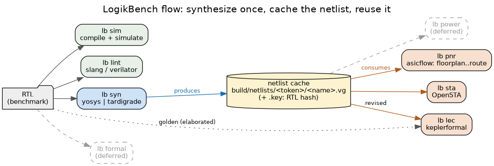

<p align="center">
  
</p>

[](LICENSE)
[](https://www.python.org/downloads/)
[](https://pypi.org/project/logikbench/)
[](https://github.com/zeroasiccorp/logikbench/actions/workflows/lint.yml)
[](https://pepy.tech/project/logikbench)

## Why LogikBench

LogikBench is a curated open source RTL benchmark suite that enables reproducible evaluation of EDA tools, process technologies, architectures, and LLMs.

> "Sunlight is said to be the best of disinfectants." --Supreme Court Justice Louis Brandeis

| Challenge              | LogikBench Solution                                     |
|------------------------|---------------------------------------------------------|
| "No Spec CPU for RTL"  | 240 robust Verilog RTL benchmark circuits               |
| Circuit diversity      | Broad mix of circuit types, sizes, and source origins   |
| Size diversity         | Per-circuit parameterization across multiple scales     |
| Trust                  | Documented source code provenance and curation criteria |
| Reproducibility        | Fully automated, push-button benchmark flows            |
| Portability            | Technology-agnostic RTL and lambdalib-based benchmarks  |
| Licensing              | Clear, permissive licensing for all included sources    |
| Quality                | Self-checking testbenches and conservative curation     |

LogikBench includes the following benchmark types:

| Benchmark type                  | Groups (-g)                 |
|---------------------------------|-----------------------------|
| Micro-benchmarks                | basic, arithmetic, memory   |
| Legacy synthetic benchmarks     | epfl, isca85, isca89, koios |
| Divers catalog of real circuits | blocks                      |
| Very large benchmarks           | large                       |

----

## Quick Start

### 1. Install LogikBench (Python 3.10+)

LogikBench is under active development. We **recommend the developer install**
(from source, editable) so you track the latest benchmarks and fixes and can
contribute changes back. The PyPI package is fine for a quick, read-only try.

**Developer install (recommended):**

```bash
git clone https://github.com/zeroasiccorp/logikbench.git
cd logikbench
python3 -m venv venv && source venv/bin/activate   # recommended
pip install -e '.[test]'                           # editable + test/dev deps
```

**Pip install (from PyPI):**

```bash
pip install logikbench
```

### 2. Install tools and run a benchmark

The steps below are the same for either install path:

```bash
# Install the EDA tools it drives (Yosys + FPGA synthesis plugins)
sc-install -group fpga

# Synthesize your first benchmark on an FPGA target
lb syn -n mux --target virtex7

# Run a whole group; metrics go to build/results/<target>.json
lb syn -g basic --target virtex7
lb syn -g basic --target asap7          # ASIC synthesis (yosys mapper)

# Simulate the self-checking testbenches, or lint the RTL
lb sim -g basic
lb lint -g basic
```

`lb -h` (or `lb <command> -h`) lists every option; the commands are `syn`
(synthesis), `pnr` (place-and-route), `sim` (simulation), and `lint`. Picking a
benchmark is optional: with neither `-g` nor `-n`, a command sweeps all groups.
For ASIC area/FMAX metrics, install `sc-install -group asic` and use an ASIC
`--target` PDK such as `freepdk45`. See [Tool Installation](#tool-installation)
for the full tool prerequisites.

----

## Benchmark Architecture

Each LogikBench benchmark circuit consists of:
* **Tech-agnostic RTL Verilog files** for broad tool compatibility
* **SiliconCompiler Design object** with metadata and configuration

The SiliconCompiler Design object captures benchmark data as files, parameters, topmodule name, and other settings grouped as a `fileset`. Every circuit in the LogikBench suite has a Python class that inherits from SiliconCompiler's Design class, as shown in this [`mux`](logikbench/benchmarks/basic/mux/mux.py) example:

```python
from os.path import dirname, abspath
from siliconcompiler import Design

class Mux(Design):
    def __init__(self):
        name = 'mux'
        fileset = 'rtl'
        rootname = f'{name}_root'
        super().__init__(name)
        self.set_dataroot(rootname, dirname(abspath(__file__)))
        self.add_file(f'rtl/{name}.v', fileset, dataroot=rootname)
        self.set_topmodule(name, fileset)
```

To use a benchmark circuit, simply instantiate its class. You then have access to all methods inherited from SiliconCompiler. The example below shows how to instantiate the `Mux` circuit and write out its RTL settings in a standard filelist format that can be read directly by tools like Icarus Verilog, Verilator, and slang.

```python
import logikbench as lb
d = lb.basic.Mux()
d.write_fileset('mux.f', fileset='rtl')
```

### AI Provenance (`ai.json`)

Some LogikBench blocks are AI-generated (RTL authored with the help of a large
language model under human direction). Any such block carries an `ai.json` file
in its directory (e.g. [`ai.json`](logikbench/benchmarks/blocks/lz77/ai.json))
that records its provenance so the origin of the design is transparent and
auditable. Blocks that are hand-written or vendored/imported from an external
source do not carry an `ai.json`.

The file captures who authored the block, which model generated it and when,
that a human reviewed it, and whether the RTL is an original implementation or
derived from an external source:

```json
{
  "schema_version": "1.0",
  "name": "lz77",
  "spec_ref": "README.md",
  "authorship": "Zero ASIC Corporation; author Andreas Olofsson",
  "generated_by": {
    "model": "claude-opus-4-8",
    "provider": "Anthropic",
    "interface": "Claude Code",
    "date": "2026-06-25"
  },
  "human_review": {
    "reviewed": true,
    "reviewer": "Andreas Olofsson",
    "date": "2026-06-25",
    "notes": "Architecture, scope, and verification were directed and reviewed by the author."
  },
  "origin": {
    "type": "original",
    "notes": "Original implementation written for LogikBench; follows the cited algorithm/standard and hardware architectures, not copied from any specific HDL source."
  }
}
```

| Field | Meaning |
|-------|---------|
| `spec_ref` | The block's specification (its `README.md`) |
| `authorship` | The party accountable for the block |
| `generated_by` | The model / provider / interface and date of generation |
| `human_review` | Whether a human reviewed it, by whom, and their notes |
| `origin` | `original` (written for LogikBench) or a derived/vendored source |

----

## Benchmark Metrics

FPGA runs report three metrics, all extracted from the Yosys synthesis run (no place-and-route): **LUTs**, **logic depth**, and **runtime**.

ASIC runs report three metrics, **Cell Area**, **FMAX**, and **runtime**. Cell
Area comes from the Yosys synthesis run; FMAX is computed by an OpenSTA timing
run on the synthesized netlist. Neither involves place-and-route.


### FPGA LUTs

> NOTE that it is impossible to do a truly fair synthesis comparison between different FPGA architectures because it's an apples to oranges comparison. The approach below is our attempt at normalization. File an issue if you disagree with it.

The LUT count is the synthesized logic-fabric usage, read from Yosys' `stat` per-cell-type report (`num_cells_by_type`). Note that ideally, each target should have a custom post processing function blessed by the vendor to fairly extract their metrics. LUTs include three kinds of cell:

1. **Lookup tables** — the basic LUT primitives, whose names vary by vendor: `LUT1..LUT6`, `$lut`, `SB_LUT4` (ice40), `EFX_LUT4` (efinix), `CC_LUT*` (gatemate), `LUTFF` (fabulous), and `CFG1..CFG4` (microchip PolarFire).

2. **Dedicated mux-fabric cells** — the hardwired wide multiplexers that live in the same logic block as the LUTs and implement muxing a LUT-only fabric would otherwise spend LUTs on: `MUXF7/MUXF8` (xilinx), `mux4x0/mux8x0` (quicklogic), `MUX2_LUT5..8` (gowin), `LUTMUX7/8` (adi), `L6MUX21/PFUMX` (lattice ECP5), `CC_MX4/CC_MX8` (gatemate), `MX4` (microchip).

3. **Hard DSP / multiply / MAC blocks** — dedicated multiplier and multiply-accumulate cells: `DSP48E1` (xilinx), `MULT18X18D` (lattice ECP5), `CC_MULT` (gatemate), `MACC_PA` (microchip), `RBBDSP` (adi), `efpga_mult*` (Zero ASIC). A fabric without them builds multipliers out of LUTs, so a target that uses a hard block would otherwise read as artificially LUT-light. (Carry/ALU cells such as `CARRY4`, `ALU`, `CCU2C`, `ARI1` are *not* DSPs and are not counted.)

Including mux cells keeps the comparison fair: ice40 has no dedicated mux, so its read/select logic is built entirely from LUTs and is fully counted; fabrics like QuickLogic or GateMate offload that same logic to mux cells, which would otherwise make their LUT count read artificially low (e.g. `regfile` on QuickLogic is mostly `mux8x0` cells, not LUTs).

Every fabric cell counts as one, regardless of its capacity: a 6-input LUT (Xilinx, ADI) packs more logic than a 4-input LUT, and a hard mux (e.g. QuickLogic `mux8x0`) does an 8:1 select that a LUT-only fabric would spend several LUTs on — but each is one cell. This makes the metric a clean *logic-cell utilization* count, most directly comparable *within* an architecture family (e.g. the Zero ASIC `z10xx` parts, or two synthesis options on one target). Across vendors the cells differ in size, so cross-vendor LUT counts are informative rather than a strict apples-to-apples ranking — each architecture wins where its cell type fits the design (mux fabrics on mux/select/decode logic, LUT/carry fabrics on arithmetic).

### FPGA Logic depth

Logic depth is the **longest combinational path** through the mapped netlist, measured by Yosys' `ltp -noff` (longest topological path, flip-flops excluded). It is the count of cells on that path, reported uniformly across all targets; the per-vendor ABC mapping reports are inconsistent (some flows print nothing), so `ltp` gives one comparable number. `ltp` only spans a single module, but the vendor `synth_*` flows flatten by default, so it covers the whole design.

Because it counts *cells*, the path includes carry-chain and mux cells, not just LUT levels — so depth, like LUTs, reflects each architecture's primitives.

### ASIC Cell Area

Cell Area is the total standard-cell area of the synthesized (mapped) netlist,
read from the same Yosys `stat` report as the FPGA cell counts. It is the sum of
the areas of every instantiated standard cell, in the area units of the target's
liberty (um^2 for the Nangate45 library used by `freepdk45`). Yosys also reports
the raw **cell count** alongside the area.

This is a *pre-layout* synthesis-area figure: it reflects the logic mapped to the
standard-cell library but not place-and-route effects (buffering, sizing, or
filler), so it tracks logic complexity rather than final silicon area. As with
the FPGA LUT count, it is most directly comparable within one PDK/library.

### ASIC FMAX

FMAX is the maximum operating frequency, computed by an OpenSTA timing run on the
synthesized netlist (`logikbench/tools/opensta/scripts/timing.tcl`). For each
clock STA finds the minimum achievable period (`find_clk_min_period`), and FMAX
is `1 / min_period`, reported in MHz.

The benchmarks ship no constraints, so a generic SDC (generated by
`logikbench/sdc.py`) attaches a clock to a port named `clk` when present, or a
virtual clock for purely combinational designs (so input-to-output paths are
still constrained). The period defaults to 1 ns and is set with the `--clk <ns>` option (on `lb
syn`/`lb pnr`); it is given in nanoseconds and scaled into each PDK's SDC time
unit (`create_clock -period` is read in the unit OpenROAD derives from the
liberty -- 1 ns for most PDKs, 1 ps for ASAP7 -- so the same `--clk` is the same
real frequency on every target). For the `lb syn` lbflow path (yosys/tardigrade)
the period is only a starting reference (FMAX is the minimum achievable period);
for the `lb pnr` asicflow path it is the real optimization target that
place-and-route works to.

### Runtime

Runtime is the wall-clock time of the synthesis step, reported to 0.01 s.

----

## Running Benchmarks

LogikBench includes the `lb` command-line tool for batch processing benchmarks. It drives SiliconCompiler flows through [SiliconCompiler](https://github.com/siliconcompiler/siliconcompiler):
each benchmark is a SiliconCompiler `Design`, and `lb` has one subcommand per task:

- `lb syn` synthesizes the selected benchmarks for one or more `--target`s (an
  ASIC PDK stem such as `freepdk45`, or an FPGA part such as `virtex7`)
  with `--tool` (yosys or, for ASIC, tardigrade). It writes a per-target metrics
  file `build/results/<target>.json`, incrementally (read-modify-write), so
  running a subset updates only those benchmarks and preserves the rest.
- `lb pnr` runs place-and-route (the SC asicflow through `route`) on an ASIC
  `--target` PDK; `--from/--to` restrict the flow (e.g. `--to synthesis.timing`
  for synth-stage metrics only).
- `lb sim` compiles and runs each benchmark's self-checking testbench; `lb lint`
  statically analyzes the RTL. Both are RTL-only (no `--target`).

Benchmark selection (`-g/--group` or `-n/--name`; default: all groups) and the
run controls (`-j`, `--timeout`, `--resume`, `--keep`, `--publish`) are common to
every command; `--publish` copies results into the committed `./results` tree
(git clone only). Run `lb <command> -h` for the full option list.

### Flow: synthesize once, reuse the netlist

`lb syn` is the only synthesizer. It caches its mapped netlist under
`build/netlists/<token>/<name>.vg` (with a `.key` that hashes the RTL, so an
edit invalidates it), and the back-end verbs -- `pnr`, `sta`, `lec` -- start
from that cached netlist instead of re-synthesizing. A cache miss (or stale
netlist) errors with a "run `lb syn` first" hint. `sim` and `lint` work
straight off the RTL and need no netlist.



### FPGA Targets

`-t/--target` selects what runs and is required; pass several to sweep them in
turn. FPGA targets are named `<vendor>_<partname>` and map to a Yosys synth
command:

| Target | Synth command |
|--------|---------------|
| `virtex7` | `synth_xilinx -family xc7` |
| `polarpro` | `synth_quicklogic -family pp3` |
| `polarfire` | `synth_microchip -family polarfire` |
| `ice40` | `synth_ice40` |
| `ecp5` | `synth_lattice -family ecp5` |
| `gw5a` | `synth_gowin -family gw5a` |
| `speedster` | `synth_achronix` |
| `flex16ffc` | `synth_analogdevices -tech t16ffc` |
| `trion` | `synth_efinix` |
| `generic` | `synth_fabulous` |
| `cologne` | `synth_gatemate` |
| `z1015` | `synth_fpga -config <arch>` (wildebeest) |
| `z1060` | `synth_fpga -config <arch>` (wildebeest) |

The `zeroasic_*` targets load the [Wildebeest](https://github.com/zeroasiccorp/wildebeest)
plugin and run `synth_fpga -config <arch>`, where `<arch>` is the per-part
architecture config vendored under `logikbench/targets/zeroasic/`.

### ASIC Targets

ASIC runs take an ASIC PDK stem as `--target`. `lb syn --tool yosys|tardigrade`
runs the lightweight `lbflow` (synthesis + OpenSTA timing, no place-and-route)
used for the QoR metrics above; `lb pnr` runs the full SiliconCompiler `asicflow`
(synth -> floorplan -> place -> cts -> route), trimmed to a single library and a
single setup corner so each benchmark stays fast. `lb pnr --to synthesis.timing`
stops the asicflow at synthesis for synth-stage metrics only.

| `--target` PDK | Library |
|----------------|---------|
| `freepdk45` | FreePDK45 / Nangate45 (lambdapdk) |
| `asap7` | ASAP7 7nm |
| `sky130` | SkyWater 130 |
| `gf180` | GlobalFoundries 180 |
| `ihp130` | IHP SG13G2 130 |

So `lb syn --target freepdk45 --tool tardigrade` runs the tardigrade lbflow, and
`lb pnr --target asap7` runs the asicflow through route on ASAP7. All of these
are lambdapdk std-cell PDKs.

### ASIC Timing Constraints (SDC)

Every ASIC run is timing-constrained automatically. You do not need to write an
SDC per benchmark: the flow generates a small wrapper that injects `--clk` and
the per-PDK knobs, then sources the shared default constraints in
`logikbench/targets/default.sdc`. Applied to every benchmark, it:

- creates one clock per port whose name matches `*clk*`/`*clock*` (so
  multi-clock designs such as `ethmac`, with `rx_clk`/`tx_clk`, are fully
  constrained), all at the `--clk` period;
- creates a single virtual clock for purely combinational benchmarks (no clock
  port), so their input-to-output paths are still timed;
- constrains all data inputs and outputs with input/output delays at 50% of the
  clock period, and applies per-PDK input transition (slew), load capacitance,
  and setup/hold clock uncertainty read from `logikbench/targets/<pdk>/tech.tcl`.

The only number you normally set is `--clk` (the clock period in nanoseconds,
the same value for every PDK; it is scaled into each PDK's native time unit):

```bash
lb syn -g basic --target freepdk45 --clk 2   # constrain every basic benchmark at 2 ns
```

**Customizing a single benchmark.** When a benchmark needs constraints the
defaults cannot express (e.g. a specific clock name, a subset of ports, a false
path), ship an SDC in the block directory and register it in the benchmark's
`.py`. Because `default.sdc` guardbands its defaults, a custom SDC only sets
what it wants to override, then sources the shared file:

```tcl
# logikbench/<group>/<name>/sdc/<name>.sdc
set LB_CLK     [get_ports my_clock]     ;# override clock detection
set LB_INPUTS  [all_inputs]             ;# or a hand-picked subset
set LB_OUTPUTS [all_outputs]
source $LB_DEFAULT_SDC                  ;# tech.tcl + generic constraints
```

Register it in the benchmark class (alongside the `rtl` fileset):

```python
self.add_file(f'sdc/{name}.sdc', 'sdc', dataroot=root)
```

The wrapper then sources your SDC instead of `default.sdc` directly. Any of
`LB_CLK`, `LB_INPUTS`, `LB_OUTPUTS` you leave unset fall back to the guardbanded
defaults; `LB_CLK_NS` (from `--clk`) and `LB_TECH_FILE`/`LB_DEFAULT_SDC` (paths)
are always injected for you.

### Options

Common to every command (`syn`, `pnr`, `sim`, `lint`):

| Flag | Description |
|------|-------------|
| `-g`, `--group` | Benchmark group(s): `basic`, `memory`, `arithmetic`, `epfl`, `blocks`, `iscas85`, `iscas89` (default: all groups; mutually exclusive with `-n`) |
| `-n`, `--name` | Act only on benchmark(s) with these name(s), searched across all groups (names are globally unique; mutually exclusive with `-g`) |
| `-b` | Build directory root; per-benchmark work goes in `<builddir>/<name>` (default: `build`) |
| `-j` | Number of benchmarks to run in parallel (default: 1) |
| `--timeout` | Per-step wall-clock cap in seconds; a step that exceeds it is killed and marked failed (default: 3600; 0 disables) |
| `--resume` | Skip benchmarks whose build already completed successfully |
| `--keep` | Keep the full per-benchmark artifacts (default: reclaim as each finishes) |
| `--publish` | Copy this run's results into the committed `./results` tree, merging incrementally. Requires a git clone (errors otherwise) |
| `-v`, `--verbose` | Show full SiliconCompiler tool/scheduler logs (quieted by default) |

Per-command flags:

| Command | Flags |
|---------|-------|
| `syn` | `-t/--target` (PDK stem or FPGA part, required), `--tool {yosys,tardigrade}`, `--clk` (ns), `--options`, `--lintonly` |
| `pnr` | `-t/--target` (ASIC PDK stem, required), `--clk` (ns), `--options`, `--lintonly`, `--from`/`--to` (flow step: `synthesis`, `floorplan`, `place`, `cts`, `route`) |
| `sim` | `--tool {icarus,verilator}` |
| `lint` | `--tool {slang,verilator}` |

Each command wipes a benchmark's build directory before running, so runs are
always fresh (no SiliconCompiler build reuse); use `--resume` to skip completed
benchmarks. `syn`/`pnr` write `build/results/<target>.json` incrementally
(read-modify-write), so a subset run updates only those benchmarks
and preserves the rest. Use `--publish` to promote them into the committed
`./results` tree (git clone only).

----

## Examples

Synthesize a group on an FPGA target (metrics -> `build/results/<target>.json`):

```bash
lb syn -g arithmetic --target virtex7
```

Synthesize a single benchmark for a Zero ASIC part (needs the wildebeest plugin):

```bash
lb syn -n mux --target z1015
```

Sweep several FPGA targets at once, 8 benchmarks in parallel:

```bash
lb syn -g basic --target virtex7 ice40 gw5a -j 8
```

Run ASIC synthesis + timing (`lbflow`) on freepdk45 with the tardigrade mapper:

```bash
lb syn -g basic --target freepdk45 --tool tardigrade
```

Run the asap7 SC asicflow through full place-and-route (stop earlier with e.g.
`--to synthesis.timing`):

```bash
lb pnr -g basic --target asap7
```

Simulate the self-checking testbenches, or lint the RTL:

```bash
lb sim -g basic
lb lint -g basic
```
----

## Benchmark Inventory

### Basic Logic (26 benchmarks)

| Benchmark | Description | Source | AI |
|-----------|-------------|--------|----|
| arbiter | Fixed-priority arbiter | [arbiter.v](logikbench/benchmarks/basic/arbiter/rtl/arbiter.v) |  |
| band | AND reduction | [band.v](logikbench/benchmarks/basic/band/rtl/band.v) |  |
| bin2gray | Binary to Gray code converter | [bin2gray.v](logikbench/benchmarks/basic/bin2gray/rtl/bin2gray.v) |  |
| bin2prio | Binary to priority encoder | [bin2prio.v](logikbench/benchmarks/basic/bin2prio/rtl/bin2prio.v) |  |
| binv | Bitwise inverter | [binv.v](logikbench/benchmarks/basic/binv/rtl/binv.v) |  |
| bnand | NAND reduction | [bnand.v](logikbench/benchmarks/basic/bnand/rtl/bnand.v) |  |
| bnor | NOR reduction | [bnor.v](logikbench/benchmarks/basic/bnor/rtl/bnor.v) |  |
| bor | OR reduction | [bor.v](logikbench/benchmarks/basic/bor/rtl/bor.v) |  |
| bxnor | XNOR reduction | [bxnor.v](logikbench/benchmarks/basic/bxnor/rtl/bxnor.v) |  |
| bxor | XOR reduction (parity) | [bxor.v](logikbench/benchmarks/basic/bxor/rtl/bxor.v) |  |
| crossbar | Crossbar switch | [crossbar.v](logikbench/benchmarks/basic/crossbar/rtl/crossbar.v) |  |
| dffasync | Asynchronous reset flip-flop | [dffasync.v](logikbench/benchmarks/basic/dffasync/rtl/dffasync.v) |  |
| dffsync | Synchronous reset flip-flop | [dffsync.v](logikbench/benchmarks/basic/dffsync/rtl/dffsync.v) |  |
| fsm | Parametrized FSM with pseudo-random transitions | [readme](logikbench/benchmarks/basic/fsm/README.md) | Y |
| gray2bin | Gray to binary code converter | [gray2bin.v](logikbench/benchmarks/basic/gray2bin/rtl/gray2bin.v) |  |
| icg | Gated-clock register | [icg.v](logikbench/benchmarks/basic/icg/rtl/icg.v) |  |
| latch | Transparent D latch | [latch.v](logikbench/benchmarks/basic/latch/rtl/latch.v) |  |
| mux | Multiplexer | [mux.v](logikbench/benchmarks/basic/mux/rtl/mux.v) |  |
| muxcase | Case-based multiplexer | [muxcase.v](logikbench/benchmarks/basic/muxcase/rtl/muxcase.v) |  |
| muxhot | One-hot multiplexer | [readme](logikbench/benchmarks/basic/muxhot/README.md) |  |
| muxpri | Priority multiplexer | [muxpri.v](logikbench/benchmarks/basic/muxpri/rtl/muxpri.v) |  |
| onehot | One-hot encoder | [onehot.v](logikbench/benchmarks/basic/onehot/rtl/onehot.v) |  |
| pipeline | Pipeline register | [pipeline.v](logikbench/benchmarks/basic/pipeline/rtl/pipeline.v) |  |
| shiftreg | Shift register | [shiftreg.v](logikbench/benchmarks/basic/shiftreg/rtl/shiftreg.v) |  |
| tff | Toggle flip-flop | [tff.v](logikbench/benchmarks/basic/tff/rtl/tff.v) |  |
| tmr | Triple-modular-redundancy voter | [tmr.v](logikbench/benchmarks/basic/tmr/rtl/tmr.v) |  |

### Arithmetic (71 benchmarks)

| Benchmark | Description | Source | AI |
|-----------|-------------|--------|----|
| abs | Absolute value | [abs.v](logikbench/benchmarks/arithmetic/abs/rtl/abs.v) |  |
| absdiff | Absolute difference | [absdiff.v](logikbench/benchmarks/arithmetic/absdiff/rtl/absdiff.v) |  |
| absdiffs | Signed absolute difference | [absdiffs.v](logikbench/benchmarks/arithmetic/absdiffs/rtl/absdiffs.v) |  |
| add | Adder | [readme](logikbench/benchmarks/arithmetic/add/README.md) |  |
| addmod | Wide modular adder (a+b) mod m | [readme](logikbench/benchmarks/arithmetic/addmod/README.md) |  |
| addsub | Adder-subtractor | [addsub.v](logikbench/benchmarks/arithmetic/addsub/rtl/addsub.v) |  |
| addtree | Balanced adder-reduction tree | [readme](logikbench/benchmarks/arithmetic/addtree/README.md) |  |
| argmax | Index of max over N | [argmax.v](logikbench/benchmarks/arithmetic/argmax/rtl/argmax.v) |  |
| argmin | Index of min over N | [argmin.v](logikbench/benchmarks/arithmetic/argmin/rtl/argmin.v) |  |
| atan | Arctangent (CORDIC vectoring) | [readme](logikbench/benchmarks/arithmetic/atan/README.md) | Y |
| avgn | Average over N (avg pool) | [avgn.v](logikbench/benchmarks/arithmetic/avgn/rtl/avgn.v) |  |
| clamp | Saturate/clip to [lo,hi] | [clamp.v](logikbench/benchmarks/arithmetic/clamp/rtl/clamp.v) |  |
| clz | Count leading zeros | [clz.v](logikbench/benchmarks/arithmetic/clz/rtl/clz.v) |  |
| cmp | Comparator | [cmp.v](logikbench/benchmarks/arithmetic/cmp/rtl/cmp.v) |  |
| cos | Cosine (CORDIC rotation) | [readme](logikbench/benchmarks/arithmetic/cos/README.md) | Y |
| counter | Counter | [counter.v](logikbench/benchmarks/arithmetic/counter/rtl/counter.v) |  |
| csa32 | 3:2 carry-save adder | [csa32.v](logikbench/benchmarks/arithmetic/csa32/rtl/csa32.v) |  |
| csa42 | 4:2 carry-save adder | [csa42.v](logikbench/benchmarks/arithmetic/csa42/rtl/csa42.v) |  |
| ctz | Count trailing zeros | [ctz.v](logikbench/benchmarks/arithmetic/ctz/rtl/ctz.v) |  |
| dec | Decrementer | [dec.v](logikbench/benchmarks/arithmetic/dec/rtl/dec.v) |  |
| div | Unsigned integer divide (sequential) | [readme](logikbench/benchmarks/arithmetic/div/README.md) | Y |
| divs | Signed integer divide (sequential) | [readme](logikbench/benchmarks/arithmetic/divs/README.md) | Y |
| dotprod | Dot product | [readme](logikbench/benchmarks/arithmetic/dotprod/README.md) |  |
| exp | Exponential (range-reduce + poly) | [readme](logikbench/benchmarks/arithmetic/exp/README.md) | Y |
| fmadd8 | Fused multiply-add, E4M3 fp8 | [readme](logikbench/benchmarks/arithmetic/fmadd8/README.md) |  |
| fmadd16 | Fused multiply-add, bf16 | [readme](logikbench/benchmarks/arithmetic/fmadd16/README.md) |  |
| fmadd32 | Fused multiply-add, fp32 | [readme](logikbench/benchmarks/arithmetic/fmadd32/README.md) |  |
| gelu | GELU activation (sigmoid approx) | [readme](logikbench/benchmarks/arithmetic/gelu/README.md) | Y |
| hswish | Hard-swish activation | [readme](logikbench/benchmarks/arithmetic/hswish/README.md) | Y |
| inc | Incrementer | [inc.v](logikbench/benchmarks/arithmetic/inc/rtl/inc.v) |  |
| ln | Natural logarithm (normalize + poly) | [readme](logikbench/benchmarks/arithmetic/ln/README.md) | Y |
| log2 | Log base 2 | [log2.v](logikbench/benchmarks/arithmetic/log2/rtl/log2.v) |  |
| lrelu | Leaky ReLU activation | [readme](logikbench/benchmarks/arithmetic/lrelu/README.md) | Y |
| mac | Multiply-accumulate | [mac.v](logikbench/benchmarks/arithmetic/mac/rtl/mac.v) |  |
| macc | Complex multiply-accumulate | [macc.v](logikbench/benchmarks/arithmetic/macc/rtl/macc.v) |  |
| macs | Signed multiply-accumulate | [macs.v](logikbench/benchmarks/arithmetic/macs/rtl/macs.v) |  |
| max | Maximum | [max.v](logikbench/benchmarks/arithmetic/max/rtl/max.v) |  |
| maxn | Max over N (max pool) | [maxn.v](logikbench/benchmarks/arithmetic/maxn/rtl/maxn.v) |  |
| min | Minimum | [min.v](logikbench/benchmarks/arithmetic/min/rtl/min.v) |  |
| mod | Unsigned modulo (sequential) | [readme](logikbench/benchmarks/arithmetic/mod/README.md) | Y |
| msub | Multiply-subtract | [msub.v](logikbench/benchmarks/arithmetic/msub/rtl/msub.v) |  |
| mul | Multiplier | [readme](logikbench/benchmarks/arithmetic/mul/README.md) |  |
| muladd | Multiply-add | [readme](logikbench/benchmarks/arithmetic/muladd/README.md) |  |
| muladdc | Complex multiply-add | [muladdc.v](logikbench/benchmarks/arithmetic/muladdc/rtl/muladdc.v) |  |
| muladds | Signed multiply-add | [muladds.v](logikbench/benchmarks/arithmetic/muladds/rtl/muladds.v) |  |
| mulc | Complex multiply | [mulc.v](logikbench/benchmarks/arithmetic/mulc/rtl/mulc.v) |  |
| mulreg | Registered multiplier | [readme](logikbench/benchmarks/arithmetic/mulreg/README.md) |  |
| muls | Signed multiplier | [readme](logikbench/benchmarks/arithmetic/muls/README.md) |  |
| mulsu | Signed x unsigned multiplier | [mulsu.v](logikbench/benchmarks/arithmetic/mulsu/rtl/mulsu.v) |  |
| multconst | Constant-coefficient multiplier | [multconst.v](logikbench/benchmarks/arithmetic/multconst/rtl/multconst.v) |  |
| popcount | Population count (set bits) | [popcount.v](logikbench/benchmarks/arithmetic/popcount/rtl/popcount.v) |  |
| premul | Pre-adder multiply (a+d)*b | [premul.v](logikbench/benchmarks/arithmetic/premul/rtl/premul.v) |  |
| recip | Fixed-point reciprocal 1/x (sequential) | [readme](logikbench/benchmarks/arithmetic/recip/README.md) | Y |
| relu | ReLU activation function | [relu.v](logikbench/benchmarks/arithmetic/relu/rtl/relu.v) |  |
| requant | Requantize (mul-shift-round-saturate) | [readme](logikbench/benchmarks/arithmetic/requant/README.md) | Y |
| rotl | Rotate left (barrel) | [rotl.v](logikbench/benchmarks/arithmetic/rotl/rtl/rotl.v) |  |
| rotr | Rotate right (barrel) | [rotr.v](logikbench/benchmarks/arithmetic/rotr/rtl/rotr.v) |  |
| round | Rounder | [round.v](logikbench/benchmarks/arithmetic/round/rtl/round.v) |  |
| rsqrt | Fixed-point inverse sqrt (sequential) | [readme](logikbench/benchmarks/arithmetic/rsqrt/README.md) | Y |
| shiftar | Arithmetic right shift | [shiftar.v](logikbench/benchmarks/arithmetic/shiftar/rtl/shiftar.v) |  |
| shiftb | Barrel shifter | [shiftb.v](logikbench/benchmarks/arithmetic/shiftb/rtl/shiftb.v) |  |
| shiftl | Left shift | [shiftl.v](logikbench/benchmarks/arithmetic/shiftl/rtl/shiftl.v) |  |
| shiftr | Right shift | [shiftr.v](logikbench/benchmarks/arithmetic/shiftr/rtl/shiftr.v) |  |
| sigmoid | Sigmoid activation (PLAN PWL) | [readme](logikbench/benchmarks/arithmetic/sigmoid/README.md) | Y |
| simdmul | Packed SIMD multiply | [simdmul.v](logikbench/benchmarks/arithmetic/simdmul/rtl/simdmul.v) |  |
| sine | Sine function | [sine.v](logikbench/benchmarks/arithmetic/sine/rtl/sine.v) |  |
| sqdiff | Squared difference | [sqdiff.v](logikbench/benchmarks/arithmetic/sqdiff/rtl/sqdiff.v) |  |
| sqrt | Square root | [readme](logikbench/benchmarks/arithmetic/sqrt/README.md) | Y |
| sub | Subtractor | [sub.v](logikbench/benchmarks/arithmetic/sub/rtl/sub.v) |  |
| sum | Summation tree | [sum.v](logikbench/benchmarks/arithmetic/sum/rtl/sum.v) |  |
| tanh | Tanh activation (PLAN PWL) | [readme](logikbench/benchmarks/arithmetic/tanh/README.md) | Y |

### Memory (17 benchmarks)

| Benchmark | Description | Source | AI |
|-----------|-------------|--------|----|
| cache | Cache memory | [cache.v](logikbench/benchmarks/memory/cache/rtl/cache.v) |  |
| cam | Content-addressable memory | [readme](logikbench/benchmarks/memory/cam/README.md) | Y |
| fifoasync | Asynchronous FIFO | [fifoasync.v](logikbench/benchmarks/memory/fifoasync/rtl/fifoasync.v) |  |
| fifosync | Synchronous FIFO | [fifosync.v](logikbench/benchmarks/memory/fifosync/rtl/fifosync.v) |  |
| ramasync | Asynchronous RAM | [ramasync.v](logikbench/benchmarks/memory/ramasync/rtl/ramasync.v) |  |
| rambit | Bit-wide RAM | [rambit.v](logikbench/benchmarks/memory/rambit/rtl/rambit.v) |  |
| rambyte | Byte-wide RAM | [rambyte.v](logikbench/benchmarks/memory/rambyte/rtl/rambyte.v) |  |
| raminit | Initialized RAM | [raminit.v](logikbench/benchmarks/memory/raminit/rtl/raminit.v) |  |
| ramtdp | True dual-port RAM (single clock) | [ramtdp.v](logikbench/benchmarks/memory/ramtdp/rtl/ramtdp.v) |  |
| ramtdpdc | True dual-port RAM (dual clock) | [ramtdpdc.v](logikbench/benchmarks/memory/ramtdpdc/rtl/ramtdpdc.v) |  |
| ramsdp | Simple dual-port RAM | [ramsdp.v](logikbench/benchmarks/memory/ramsdp/rtl/ramsdp.v) |  |
| ramsp | Single-port RAM | [ramsp.v](logikbench/benchmarks/memory/ramsp/rtl/ramsp.v) |  |
| ramspnc | Single-port RAM (no change) | [ramspnc.v](logikbench/benchmarks/memory/ramspnc/rtl/ramspnc.v) |  |
| ramsprf | Single-port RAM (read-first) | [ramsprf.v](logikbench/benchmarks/memory/ramsprf/rtl/ramsprf.v) |  |
| ramspwf | Single-port RAM (write-first) | [ramspwf.v](logikbench/benchmarks/memory/ramspwf/rtl/ramspwf.v) |  |
| regfile | Register file | [readme](logikbench/benchmarks/memory/regfile/README.md) |  |
| rom | Read-only memory | [rom.v](logikbench/benchmarks/memory/rom/rtl/rom.v) |  |

### Complex Blocks (37 benchmarks)

| Benchmark | Description | Source | AI |
|-----------|-------------|--------|----|
| apbregs | APB register file | [apbregs.v](logikbench/benchmarks/blocks/apbregs/rtl/apbregs.v) |  |
| axiram | AXI RAM interface | [readme](logikbench/benchmarks/blocks/axiram/README.md) |  |
| conv2d | Streaming 3x3 2D convolution | [readme](logikbench/benchmarks/blocks/conv2d/README.md) | Y |
| crc32 | CRC-32 generator | [readme](logikbench/benchmarks/blocks/crc32/README.md) | Y |
| codec8b10b | 8b/10b line encoder/decoder | [readme](logikbench/benchmarks/blocks/codec8b10b/README.md) | Y |
| ddc | Digital down-converter (NCO/mixer/CIC/FIR) | [readme](logikbench/benchmarks/blocks/ddc/README.md) | Y |
| ethmac | Ethernet MAC | [readme](logikbench/benchmarks/blocks/ethmac/README.md) |  |
| fft | Fast Fourier Transform | [readme](logikbench/benchmarks/blocks/fft/README.md) | Y |
| firfix | Fixed-coefficient FIR filter | [firfix.v](logikbench/benchmarks/blocks/firfix/rtl/firfix.v) |  |
| firprog | Programmable FIR filter | [firprog.v](logikbench/benchmarks/blocks/firprog/rtl/firprog.v) |  |
| fpu64 | 64-bit floating-point unit | [fpu64/](logikbench/benchmarks/blocks/fpu64/) |  |
| gearbox66 | 64b/66b scrambler + gearbox | [readme](logikbench/benchmarks/blocks/gearbox66/README.md) | Y |
| hamming | Hamming ECC encoder/decoder | [readme](logikbench/benchmarks/blocks/hamming/README.md) | Y |
| hft | Tick-to-trade HFT pipeline | [readme](logikbench/benchmarks/blocks/hft/README.md) | Y |
| hmac | HMAC-SHA hashing | [readme](logikbench/benchmarks/blocks/hmac/README.md) |  |
| huffman | Canonical Huffman encoder/decoder | [readme](logikbench/benchmarks/blocks/huffman/README.md) | Y |
| i2c | I2C controller | [readme](logikbench/benchmarks/blocks/i2c/README.md) |  |
| ialu | Integer ALU | [readme](logikbench/benchmarks/blocks/ialu/README.md) |  |
| jesd204b | JESD204B full-duplex link interface | [readme](logikbench/benchmarks/blocks/jesd204b/README.md) | Y |
| lfsr | Linear feedback shift register | [readme](logikbench/benchmarks/blocks/lfsr/README.md) |  |
| linkmap | JESD204-style transport framer/deframer | [readme](logikbench/benchmarks/blocks/linkmap/README.md) | Y |
| lpddr5 | LPDDR5 memory controller (UMI + DFI, ECC) | [readme](logikbench/benchmarks/blocks/lpddr5/README.md) | Y |
| median3x3 | Streaming 3x3 median filter | [readme](logikbench/benchmarks/blocks/median3x3/README.md) | Y |
| openpiton | OpenPiton manycore tile | [readme](logikbench/benchmarks/blocks/openpiton/README.md) |  |
| picorv32 | PicoRV32 RISC-V core | [readme](logikbench/benchmarks/blocks/picorv32/README.md) |  |
| reedsolomon | Reed-Solomon RS(544,514) codec | [readme](logikbench/benchmarks/blocks/reedsolomon/README.md) | Y |
| sad8x8 | 8x8 sum of absolute differences | [readme](logikbench/benchmarks/blocks/sad8x8/README.md) | Y |
| serv | SERV bit-serial RISC-V core | [readme](logikbench/benchmarks/blocks/serv/README.md) |  |
| sobel3x3 | Streaming 3x3 Sobel edge detector | [readme](logikbench/benchmarks/blocks/sobel3x3/README.md) | Y |
| spi | SPI controller | [readme](logikbench/benchmarks/blocks/spi/README.md) |  |
| tpu | Weight-stationary systolic matrix multiply (TPU MXU) | [readme](logikbench/benchmarks/blocks/tpu/README.md) | Y |
| uart | UART | [readme](logikbench/benchmarks/blocks/uart/README.md) |  |
| umicross | UMI crossbar | [readme](logikbench/benchmarks/blocks/umicross/README.md) |  |
| umidev | UMI device endpoint | [readme](logikbench/benchmarks/blocks/umidev/README.md) |  |
| umiregs | UMI register file | [umiregs.v](logikbench/benchmarks/blocks/umiregs/rtl/umiregs.v) |  |
| viterbi | Viterbi decoder | [readme](logikbench/benchmarks/blocks/viterbi/README.md) | Y |
| wordalign | Comma detect + bitslip aligner | [readme](logikbench/benchmarks/blocks/wordalign/README.md) | Y |

### Large Benchmarks (12 benchmarks)

| Benchmark | Description | Source | AI |
|-----------|-------------|--------|----|
| aes | AES encryption core | [readme](logikbench/benchmarks/large/aes/README.md) |  |
| axicrossbar | AXI crossbar | [readme](logikbench/benchmarks/large/axicrossbar/README.md) |  |
| blackparrot | BlackParrot RISC-V core | [readme](logikbench/benchmarks/large/blackparrot/README.md) |  |
| coralnpu | CoralNPU neural accelerator | [readme](logikbench/benchmarks/large/coralnpu/README.md) |  |
| cva6 | CVA6 (Ariane) RISC-V core | [readme](logikbench/benchmarks/large/cva6/README.md) |  |
| lz77 | LZ77 compressor/decompressor | [readme](logikbench/benchmarks/large/lz77/README.md) | Y |
| nvdla | NVDLA deep-learning accelerator | [readme](logikbench/benchmarks/large/nvdla/README.md) |  |
| ofdm | OFDM modem (QAM + IFFT/FFT) | [readme](logikbench/benchmarks/large/ofdm/README.md) | Y |
| rocket | Rocket RISC-V core | [readme](logikbench/benchmarks/large/rocket/README.md) |  |
| sonicboom | SonicBOOM (v3) out-of-order RISC-V core | [readme](logikbench/benchmarks/large/sonicboom/README.md) |  |
| vortex | Vortex GPU core | [readme](logikbench/benchmarks/large/vortex/README.md) |  |
| wally | CVW-Wally RISC-V core | [readme](logikbench/benchmarks/large/wally/README.md) |  |

### EPFL Benchmarks (19 benchmarks)

| Benchmark | Description | Source |
|-----------|-------------|--------|
| adder | EPFL adder benchmark | [adder.v](logikbench/benchmarks/epfl/adder/rtl/adder.v) |
| arbiter | EPFL arbiter benchmark | [arbiter.v](logikbench/benchmarks/epfl/arbiter/rtl/arbiter.v) |
| bar | Barrel shifter | [bar.v](logikbench/benchmarks/epfl/bar/rtl/bar.v) |
| cavlc | CAVLC encoder | [cavlc.v](logikbench/benchmarks/epfl/cavlc/rtl/cavlc.v) |
| dec | Decoder | [dec.v](logikbench/benchmarks/epfl/dec/rtl/dec.v) |
| div | Divider | [div.v](logikbench/benchmarks/epfl/div/rtl/div.v) |
| hyp | Hypotenuse calculator | [hyp.v](logikbench/benchmarks/epfl/hyp/rtl/hyp.v) |
| i2c | I2C controller | [i2c.v](logikbench/benchmarks/epfl/i2c/rtl/i2c.v) |
| int2float | Integer to float converter | [int2float.v](logikbench/benchmarks/epfl/int2float/rtl/int2float.v) |
| log2 | Log base 2 | [log2.v](logikbench/benchmarks/epfl/log2/rtl/log2.v) |
| max | Maximum | [max.v](logikbench/benchmarks/epfl/max/rtl/max.v) |
| memctrl | Memory controller | [memctrl.v](logikbench/benchmarks/epfl/memctrl/rtl/memctrl.v) |
| multiplier | Multiplier | [multiplier.v](logikbench/benchmarks/epfl/multiplier/rtl/multiplier.v) |
| priority | Priority encoder | [priority.v](logikbench/benchmarks/epfl/priority/rtl/priority.v) |
| router | Router | [router.v](logikbench/benchmarks/epfl/router/rtl/router.v) |
| sin | Sine function | [sin.v](logikbench/benchmarks/epfl/sin/rtl/sin.v) |
| sqrt | Square root | [sqrt.v](logikbench/benchmarks/epfl/sqrt/rtl/sqrt.v) |
| square | Square function | [square.v](logikbench/benchmarks/epfl/square/rtl/square.v) |
| voter | Voter circuit | [voter.v](logikbench/benchmarks/epfl/voter/rtl/voter.v) |

### ISCAS85 Benchmarks (11 benchmarks)

Combinational gate-level circuits. See [iscas85/README.md](logikbench/benchmarks/iscas85/README.md).

| Benchmark | Description | Source |
|-----------|-------------|--------|
| c17 | Trivial 6-gate circuit | [c17.v](logikbench/benchmarks/iscas85/c17/rtl/c17.v) |
| c432 | 27-channel interrupt controller | [c432.v](logikbench/benchmarks/iscas85/c432/rtl/c432.v) |
| c499 | 32-bit single-error-correcting circuit | [c499.v](logikbench/benchmarks/iscas85/c499/rtl/c499.v) |
| c880 | 8-bit ALU | [c880.v](logikbench/benchmarks/iscas85/c880/rtl/c880.v) |
| c1355 | 32-bit single-error-correcting circuit | [c1355.v](logikbench/benchmarks/iscas85/c1355/rtl/c1355.v) |
| c1908 | 16-bit SEC/DED circuit | [c1908.v](logikbench/benchmarks/iscas85/c1908/rtl/c1908.v) |
| c2670 | 12-bit ALU and controller | [c2670.v](logikbench/benchmarks/iscas85/c2670/rtl/c2670.v) |
| c3540 | 8-bit ALU | [c3540.v](logikbench/benchmarks/iscas85/c3540/rtl/c3540.v) |
| c5315 | ALU with parity | [c5315.v](logikbench/benchmarks/iscas85/c5315/rtl/c5315.v) |
| c6288 | 16x16 combinational multiplier | [c6288.v](logikbench/benchmarks/iscas85/c6288/rtl/c6288.v) |
| c7552 | 32-bit adder/comparator | [c7552.v](logikbench/benchmarks/iscas85/c7552/rtl/c7552.v) |

### ISCAS89 Benchmarks (28 benchmarks)

Sequential gate-level circuits (clock port `CK`). See [iscas89/README.md](logikbench/benchmarks/iscas89/README.md).

| Benchmark | Description | Source |
|-----------|-------------|--------|
| s27 | Sequential benchmark circuit | [s27.v](logikbench/benchmarks/iscas89/s27/rtl/s27.v) |
| s298 | Sequential benchmark circuit | [s298.v](logikbench/benchmarks/iscas89/s298/rtl/s298.v) |
| s344 | Sequential benchmark circuit | [s344.v](logikbench/benchmarks/iscas89/s344/rtl/s344.v) |
| s349 | Sequential benchmark circuit | [s349.v](logikbench/benchmarks/iscas89/s349/rtl/s349.v) |
| s382 | Sequential benchmark circuit | [s382.v](logikbench/benchmarks/iscas89/s382/rtl/s382.v) |
| s386 | Sequential benchmark circuit | [s386.v](logikbench/benchmarks/iscas89/s386/rtl/s386.v) |
| s400 | Sequential benchmark circuit | [s400.v](logikbench/benchmarks/iscas89/s400/rtl/s400.v) |
| s420 | Sequential benchmark circuit | [s420.v](logikbench/benchmarks/iscas89/s420/rtl/s420.v) |
| s444 | Sequential benchmark circuit | [s444.v](logikbench/benchmarks/iscas89/s444/rtl/s444.v) |
| s510 | Sequential benchmark circuit | [s510.v](logikbench/benchmarks/iscas89/s510/rtl/s510.v) |
| s526 | Sequential benchmark circuit | [s526.v](logikbench/benchmarks/iscas89/s526/rtl/s526.v) |
| s641 | Sequential benchmark circuit | [s641.v](logikbench/benchmarks/iscas89/s641/rtl/s641.v) |
| s713 | Sequential benchmark circuit | [s713.v](logikbench/benchmarks/iscas89/s713/rtl/s713.v) |
| s820 | Sequential benchmark circuit | [s820.v](logikbench/benchmarks/iscas89/s820/rtl/s820.v) |
| s832 | Sequential benchmark circuit | [s832.v](logikbench/benchmarks/iscas89/s832/rtl/s832.v) |
| s838 | Sequential benchmark circuit | [s838.v](logikbench/benchmarks/iscas89/s838/rtl/s838.v) |
| s953 | Sequential benchmark circuit | [s953.v](logikbench/benchmarks/iscas89/s953/rtl/s953.v) |
| s1196 | Sequential benchmark circuit | [s1196.v](logikbench/benchmarks/iscas89/s1196/rtl/s1196.v) |
| s1238 | Sequential benchmark circuit | [s1238.v](logikbench/benchmarks/iscas89/s1238/rtl/s1238.v) |
| s1423 | Sequential benchmark circuit | [s1423.v](logikbench/benchmarks/iscas89/s1423/rtl/s1423.v) |
| s1488 | Sequential benchmark circuit | [s1488.v](logikbench/benchmarks/iscas89/s1488/rtl/s1488.v) |
| s5378 | Sequential benchmark circuit | [s5378.v](logikbench/benchmarks/iscas89/s5378/rtl/s5378.v) |
| s9234 | Sequential benchmark circuit | [s9234.v](logikbench/benchmarks/iscas89/s9234/rtl/s9234.v) |
| s13207 | Sequential benchmark circuit | [s13207.v](logikbench/benchmarks/iscas89/s13207/rtl/s13207.v) |
| s15850 | Sequential benchmark circuit | [s15850.v](logikbench/benchmarks/iscas89/s15850/rtl/s15850.v) |
| s35932 | Sequential benchmark circuit | [s35932.v](logikbench/benchmarks/iscas89/s35932/rtl/s35932.v) |
| s38417 | Sequential benchmark circuit | [s38417.v](logikbench/benchmarks/iscas89/s38417/rtl/s38417.v) |
| s38584 | Sequential benchmark circuit | [s38584.v](logikbench/benchmarks/iscas89/s38584/rtl/s38584.v) |

### Koios Benchmarks (19 benchmarks)

Deep-learning accelerator and layer designs (pure RTL, hard blocks disabled). See [koios/README.md](logikbench/benchmarks/koios/README.md).

| Benchmark | Description | Source |
|-----------|-------------|--------|
| attention_layer | Transformer self-attention layer | [attention_layer.v](logikbench/benchmarks/koios/attention_layer/rtl/attention_layer.v) |
| conv_layer | GEMM-based convolution layer | [conv_layer.v](logikbench/benchmarks/koios/conv_layer/rtl/conv_layer.v) |
| conv_layer_hls | Sliding-window convolution (HLS style) | [conv_layer_hls.v](logikbench/benchmarks/koios/conv_layer_hls/rtl/conv_layer_hls.v) |
| eltwise_layer | Matrix elementwise add / sub / mult | [eltwise_layer.v](logikbench/benchmarks/koios/eltwise_layer/rtl/eltwise_layer.v) |
| reduction_layer | Add / max / min reduction tree | [reduction_layer.v](logikbench/benchmarks/koios/reduction_layer/rtl/reduction_layer.v) |
| gemm_layer | 20x20 matrix-multiplication engine | [gemm_layer.v](logikbench/benchmarks/koios/gemm_layer/rtl/gemm_layer.v) |
| softmax | Softmax classification layer | [softmax.v](logikbench/benchmarks/koios/softmax/rtl/softmax.v) |
| spmv | Sparse matrix-vector multiplication | [spmv.v](logikbench/benchmarks/koios/spmv/rtl/spmv.v) |
| lstm | LSTM engine | [lstm.v](logikbench/benchmarks/koios/lstm/rtl/lstm.v) |
| robot_rl | Reinforcement-learning | [robot_rl.v](logikbench/benchmarks/koios/robot_rl/rtl/robot_rl.v) |
| dnnweaver | DNNWeaver-like accelerator | [dnnweaver.v](logikbench/benchmarks/koios/dnnweaver/rtl/dnnweaver.v) |
| tpu_like_small_os | Google-TPU-v1 (output-stationary) | [tpu_like_small_os.v](logikbench/benchmarks/koios/tpu_like_small_os/rtl/tpu_like_small_os.v) |
| tpu_like_small_ws | Google-TPU-v1 (weight-stationary) | [tpu_like_small_ws.v](logikbench/benchmarks/koios/tpu_like_small_ws/rtl/tpu_like_small_ws.v) |
| clstm_like_small | CLSTM-like accelerator (small) | [clstm_like_small.v](logikbench/benchmarks/koios/clstm_like_small/rtl/clstm_like_small.v) |
| clstm_like_medium | CLSTM-like accelerator (medium) | [clstm_like_medium.v](logikbench/benchmarks/koios/clstm_like_medium/rtl/clstm_like_medium.v) |
| dla_like_small | Intel-DLA-like accelerator (small) | [dla_like_small.v](logikbench/benchmarks/koios/dla_like_small/rtl/dla_like_small.v) |
| dla_like_medium | Intel-DLA-like accelerator (medium) | [dla_like_medium.v](logikbench/benchmarks/koios/dla_like_medium/rtl/dla_like_medium.v) |
| bwave_like_fixed_small | Microsoft-Brainwave-like NPU | [bwave_like_fixed_small.v](logikbench/benchmarks/koios/bwave_like_fixed_small/rtl/bwave_like_fixed_small.v) |
| bwave_like_float_small | Microsoft-Brainwave-like NPU | [bwave_like_float_small.v](logikbench/benchmarks/koios/bwave_like_float_small/rtl/bwave_like_float_small.v) |

----


## Leaderboard (WIP)

Targets ranked by total LUTs over all benchmarks (config: `small`), lowest first. A benchmark with no result for a target is charged the highest LUT count any target reached on it.
Comparing different FPGA architectures is by definition an apples to oranges exercise. Ranking by no means implies quality or goodness, it's just a neat way to compress and order data.

### ASIC Synthesis

ASIC leaderboard tables (cell area and FMAX, starting with `freepdk45`) are
work in progress and will be published here once results are collected.

## Tool Installation

LogikBench itself is pure Python. Because the project is under active
development, the **developer install (from source, editable) is recommended**;
the released PyPI package is available for a quick, read-only try:

```bash
# Developer install (recommended): editable, with test/dev deps
git clone https://github.com/zeroasiccorp/logikbench.git
cd logikbench
pip install -e '.[test]'

# Or install the released package from PyPI
pip install logikbench
```
Running benchmarks additionally needs the EDA tools that SiliconCompiler drives.
The `sc-install` helper (shipped with SiliconCompiler) builds and installs them.
Install by group, or name individual tools:

```bash
sc-install -group fpga          # FPGA synthesis (Yosys + vendor plugins)
sc-install -group asic          # ASIC synthesis + timing (Yosys, OpenROAD, OpenSTA)
```

Useful flags: `-prefix <path>` to install somewhere other than the default,
`-build_dir <path>` to build elsewhere, and `-jobs <N>` to limit parallel build
jobs on memory-constrained machines.

| Use case | Tools | Group |
|----------|-------|-------|
| FPGA LUT / depth metrics | Yosys (+ vendor synth plugins) | `fpga` |
| ASIC area / FMAX metrics | Yosys, OpenROAD, OpenSTA | `asic` |
| RTL simulation (testbenches) | Icarus Verilog, Verilator | `digital-simulation` |

## Extending LogikBench with your own tools

LogikBench runs on SiliconCompiler's tool set, but the **flows are defined
locally** (`logikbench/flows/<task>/`, one per `lb` command) and you can plug in
**tools SC does not ship** -- including proprietary/commercial EDA tools (Design
Compiler, Genus, Vivado, Innovus, PrimeTime, VCS, JasperGold, ...). That is what
`logikbench/tools/` is for, and it is exactly how the built-in `tardigrade`
mapper is integrated.

A tool is just a SiliconCompiler `Task` subclass placed under
`logikbench/tools/<tool>/` -- SC's `Task` API is subclassable, so no SC fork is
needed. The reference implementation is
[`tools/tardigrade/tardigrade.py`](logikbench/tools/tardigrade/tardigrade.py): a
base task declares the executable, version switch, and log regexes; a concrete
task per role adds its parameters, required filesets, command line, and metric
scraping.

To make it selectable, add one line to the relevant flow's tool dict:

```python
# logikbench/flows/syn/asic.py
from logikbench.tools.design_compiler.design_compiler import Synthesis as DCSynthesis

class ASICSynthesis(Flowgraph):
    _SYNTH = {
        "yosys": YosysSynthesis,
        "tardigrade": TardigradeSynthesis,
        "design_compiler": DCSynthesis,   # <-- your tool, one line
    }
```

Then `lb syn --tool design_compiler ...` uses it. SiliconCompiler handles
executable and license detection at run time, so a tool you do not have
installed simply is not selectable -- it never breaks the other flows. The full
guide (including monolithic vendor flows that do several stages at once, and
customized variants of SC's own tools) is in
[`logikbench/tools/README.md`](logikbench/tools/README.md).

## License

The LogikBench project is licensed under the [MIT](LICENSE) license unless specified otherwise inside the individual benchmark folders.